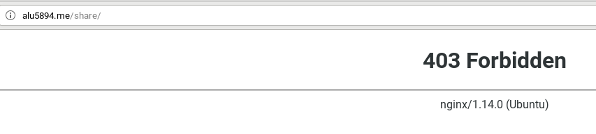

# Listado de Directorios

Modificamos el fichero alu5894.me para añadir un "location" el cual se llamará "shared".
> En esta primera imagen, veremos que el **server_name** es "vps.alu5894.me" y el location tiene de nombre "share" en vez de "shared". Todo esto lo arreglamos más adelante.

Creamos el directorio "share" dentro de "/webapps" y a continuación enlazamos con un enlase simbólico desde el directorio "share" hasta los respectivos ficheros del sistema.

> El enlace que creamos a **/etc/bashrc** es incorrecto y lo solucionamos más tarde.

 

### Corrección del enlace bash

Recargamos los cambios en el servidor nginx para actualizarlo y comprobamos.

> Vemos que nos da un error 403 de prohibído.

Modificamos el archivo ***alu5894.me***

> Cambiamos el nombre de "server_name" al correcto y añadimos en el location **share** un párrafo llamado autoindex para dar acceso al contenido del directorio actual y sus subdirectorios.

Hacemos un reload del servicio Nginx y comprobamos que funciona.

Clickamos en un enlace al azar y vemos que nos da la opción de guardar por lo que está todo correcto.

# Anexo

Arreglamos el location y directorio "share" a ***shared***.

