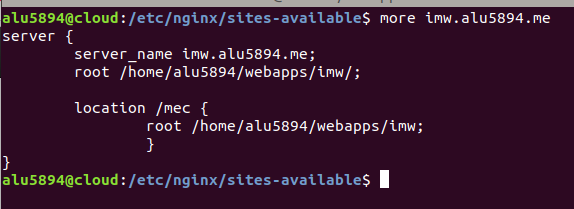
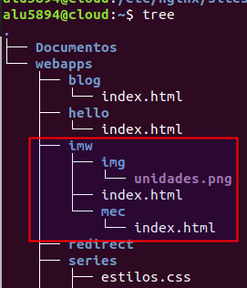
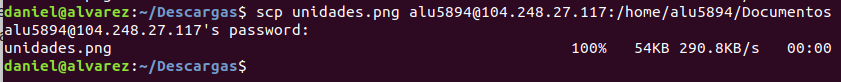
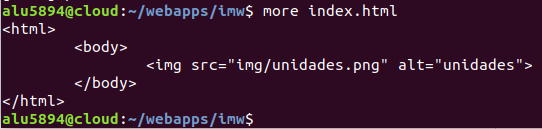
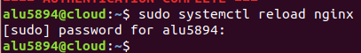
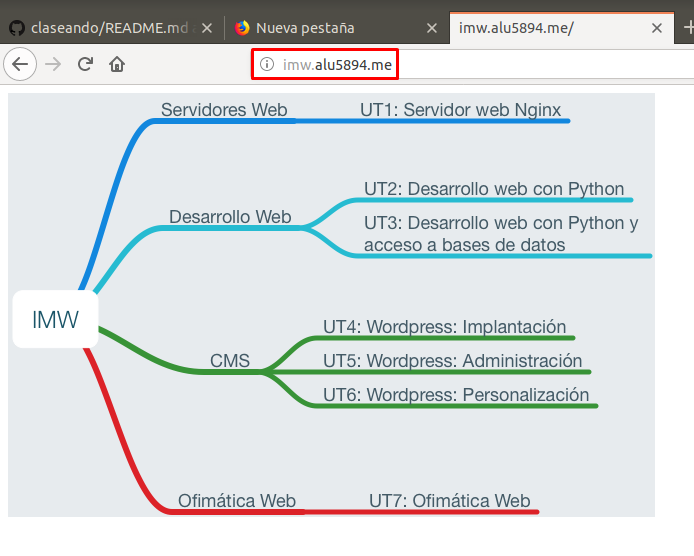
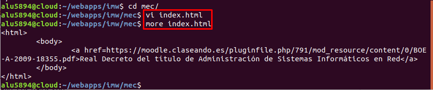
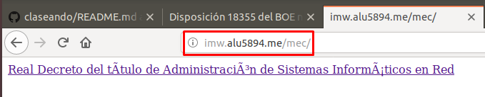

# Trabajo con Virtual Hosts

## Sitio web 1

Creamos dentro de ***/etc/nginx/sites-available/*** el fichero imw.alu5894.me y lo configuramos correctamente para crear el Virtual Host junto al location ***mec***.

En el directorio ***webapps*** creamos la carpeta que contenga todo lo relacionado al Virtual Host y como especificamos al configurarla previamente.

> Tanto el directorio como *imw* como *mec* tendrán sus propios indexs.

Descargamos la imagen del **Diagrama de unidades de trabajo** en la máquina de desarrollo y la enviamos mediante ssh a la máquina de producción.

A continuación, creamos un index.html en el directorio ***imw*** y añadimos la imagen.

> Previamente movemos la imagen de Documentos a /webapps/imw/img.

Recargamos el nginx y comprobamos.

Ya tenemos creado todo lo relacionado con imw, por lo que vamos a trabajar con ***mec***. Creamos un index y añadimos un enlace que nos lleve al Real Decreto del título de administración de Sistemas informáticos en Red mediante.

Recargamos el nginx y comprobamos.

