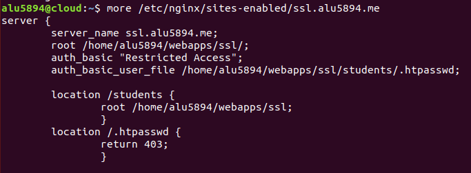
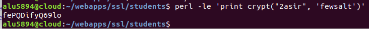
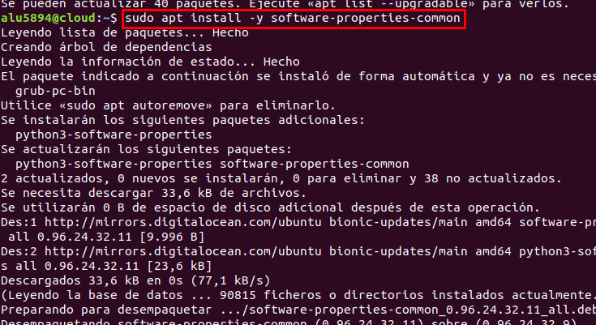
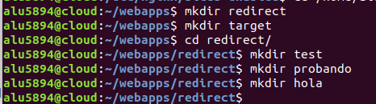

# Trabajo con Virtual Hosts

## Sitio web 1

Creamos dentro de ***/etc/nginx/sites-available/*** el fichero imw.alu5894.me y lo configuramos correctamente para crear el Virtual Host junto al location ***mec***.


En el directorio ***webapps*** creamos la carpeta que contenga todo lo relacionado al Virtual Host y como especificamos al configurarla previamente.

> Tanto el directorio como *imw* como *mec* tendrán sus propios indexs.


Descargamos la imagen del **Diagrama de unidades de trabajo** en la máquina de desarrollo y la enviamos mediante ssh a la máquina de producción.


A continuación, creamos un index.html en el directorio ***imw*** y añadimos la imagen.

> Previamente movemos la imagen de Documentos a /webapps/imw/img.


Recargamos el nginx y comprobamos.


Ya tenemos creado todo lo relacionado con imw, por lo que vamos a trabajar con ***mec***. Creamos un index y añadimos un enlace que nos lleve al Real Decreto del título de administración de Sistemas informáticos en Red mediante.


Recargamos el nginx y comprobamos.


## Sitio web 2

Esta vez crearemos un Virtual Host que esté escuchando mediante el puerto 9000 y que muestre un listado de ficheros mediante enlaces simbólicos.

Comenzamos creando el Virtual Host ***varlib*** y configurandolo para que escuche por el puerto 9000 y añadimos autoindex para que reconozca todo el contenido del directorio deseado, en este caso, varlib.


En webapps, creamos el directorio correspondiente al Virtual Host y dentro de éste, creamos un enlace simbólico a ***/var/lib/***.


Recargamos el servicio nginx y comprobamos.


## Sitio web 3

Creamos el Virtual Host correspondiente y lo configuramos para que su acceso sea restringido y se requiera de un usuario y contraseña. También vamos a restringir el paso al fichero donde se guarda esta información confidencial y crearemos eel location ***/students***.

> El location para /.htpasswd hace que retorne un error 403 si intentan acceder a él.



Creamos una contraseña, la "encriptamos" y la metemos en el fichero ***.htpasswd***.




Creamos el fichero index, recargamos el nginx y comprobamos.


Para obtener un certificado de seguridad y conseguir que nuestra web sea https, tenemos que instalar certbot.




Después de instalarlo, nos hará una serie de preguntas:

```bash
alu5894@cloud:~$ sudo certbot --nginx
Saving debug log to /var/log/letsencrypt/letsencrypt.log
Plugins selected: Authenticator nginx, Installer nginx
Enter email address (used for urgent renewal and security notices) (Enter 'c' to
cancel): alu5894@iespuertodelacruz.es

-------------------------------------------------------------------------------
Please read the Terms of Service at
https://letsencrypt.org/documents/LE-SA-v1.2-November-15-2017.pdf. You must
agree in order to register with the ACME server at
https://acme-v01.api.letsencrypt.org/directory
-------------------------------------------------------------------------------
(A)gree/(C)ancel: a

-------------------------------------------------------------------------------
Would you be willing to share your email address with the Electronic Frontier
Foundation, a founding partner of the Let's Encrypt project and the non-profit
organization that develops Certbot? We'd like to send you email about EFF and
our work to encrypt the web, protect its users and defend digital rights.
-------------------------------------------------------------------------------
(Y)es/(N)o: n

Which names would you like to activate HTTPS for?
-------------------------------------------------------------------------------
1: alu5894.me
2: hello.alu5894.me
3: imw.alu5894.me
4: ssl.alu5894.me
5: varlib.alu5894.me
-------------------------------------------------------------------------------
Select the appropriate numbers separated by commas and/or spaces, or leave input
blank to select all options shown (Enter 'c' to cancel): 4
Obtaining a new certificate
Performing the following challenges:
http-01 challenge for ssl.alu5894.me
Waiting for verification...
Cleaning up challenges
Deploying Certificate to VirtualHost /etc/nginx/sites-enabled/ssl.alu5894.me

Please choose whether or not to redirect HTTP traffic to HTTPS, removing HTTP access.
-------------------------------------------------------------------------------
1: No redirect - Make no further changes to the webserver configuration.
2: Redirect - Make all requests redirect to secure HTTPS access. Choose this for
new sites, or if you're confident your site works on HTTPS. You can undo this
change by editing your web server's configuration.
-------------------------------------------------------------------------------
Select the appropriate number [1-2] then [enter] (press 'c' to cancel): 2
Redirecting all traffic on port 80 to ssl in /etc/nginx/sites-enabled/ssl.alu5894.me

-------------------------------------------------------------------------------
Congratulations! You have successfully enabled https://ssl.alu5894.me

You should test your configuration at:
https://www.ssllabs.com/ssltest/analyze.html?d=ssl.alu5894.me
-------------------------------------------------------------------------------

IMPORTANT NOTES:
 - Congratulations! Your certificate and chain have been saved at:
   /etc/letsencrypt/live/ssl.alu5894.me/fullchain.pem
   Your key file has been saved at:
   /etc/letsencrypt/live/ssl.alu5894.me/privkey.pem
   Your cert will expire on 2020-01-05. To obtain a new or tweaked
   version of this certificate in the future, simply run certbot again
   with the "certonly" option. To non-interactively renew *all* of
   your certificates, run "certbot renew"
 - Your account credentials have been saved in your Certbot
   configuration directory at /etc/letsencrypt. You should make a
   secure backup of this folder now. This configuration directory will
   also contain certificates and private keys obtained by Certbot so
   making regular backups of this folder is ideal.
 - If you like Certbot, please consider supporting our work by:

   Donating to ISRG / Let's Encrypt:   https://letsencrypt.org/donate
   Donating to EFF:                    https://eff.org/donate-le

alu5894@cloud:~$
```

Visualizamos el fichero del Virtual Host y vemos que certbot lo ha modificado.


Recargamos el nginx y comprobamos.


## Sitio web 4

Creamos los Virtual Hosts requeridos.


Creamos en ***webapps*** los directorios de los Virtual Hosts

> En la imagen aparece que creamos más directorios pero no influyen en nada.



Descargamos en la máquina de desarrollo el archivo comprimido ***initializr.zip*** y lo pasamos a la máquina de producción a través de ssh.


Una vez traspasado el archivo, lo movemos a la ubicación deseada y lo descomprimimos.

> Una vez descomprimido, tendremos otro directorio llamado ***initializr*** y puede dar error en la ruta que configuramos. Por lo que podemos mover todo su contenido a /target o modificar la ruta en el fichero Virtual Host.


Recargamos y comprobamos.


Modificamos el fichero ***redirect.alu5894.me*** y añadimos que escuche por el puerto 80 (porque es una página HTTP) y que redirija todas las peticiones que le lleguen al dominio de ***target.alu5894.me***. Además, también configuraremos para que los **logs** de acceso y error, de dicho Virtual Host, se guarden en una ruta específica.


Una vez terminado todo, recargamos y debería funcionar correctamente.


