# Sitio Web 1

Descargamos el Zip necesario para la práctica y lo compartimos con la máquina de producción mediante ssh.

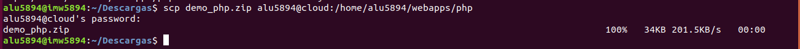

Descomprimimos.

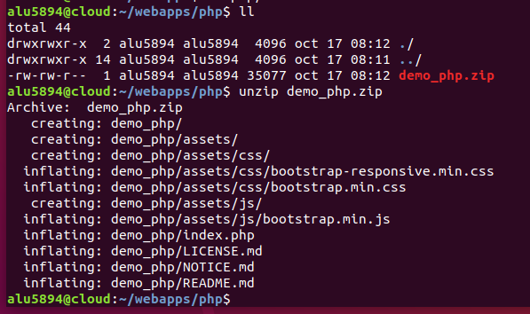

Creamos el Virtual Host, lo configuramos para que lea el index indicado y un location que todo lo parecido a la extensión php, sea leido por un socket específico que indicaremos. Este Virtual Host fue creado en sites-available y enlazado a sites-enabled con un enlace simbólico (ln -s).

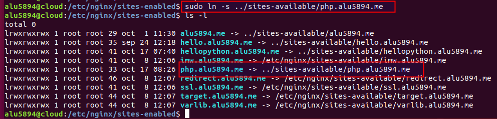

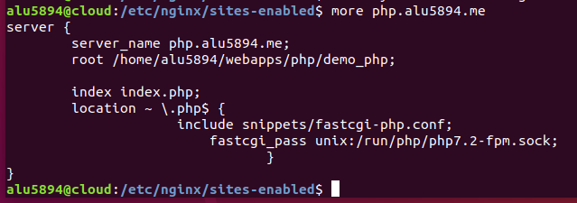

Recargamos nginx y comprobamos.

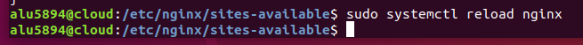

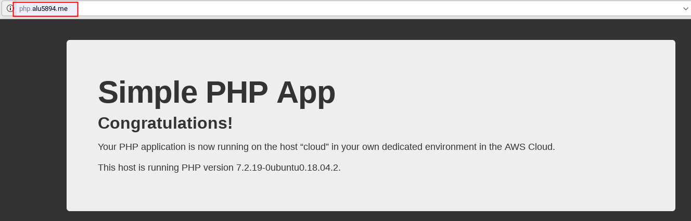

# Sitio Web 2

Creamos el directorio donde alojaremos un entorno virtual con algunas aplicaciones extra como flask y pytz.

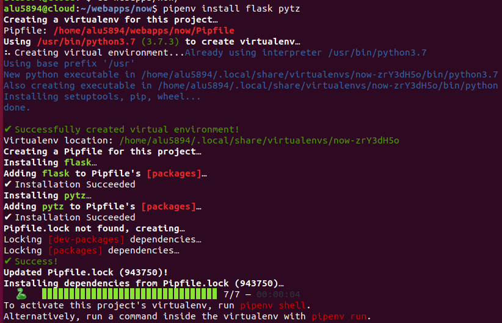

Creamos y configuramos un fichero específico para nuestro Virtual Host.

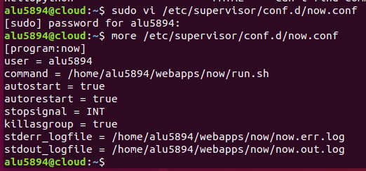

Comprobamos el estado del supervisor e iniciamos el proceso "now".

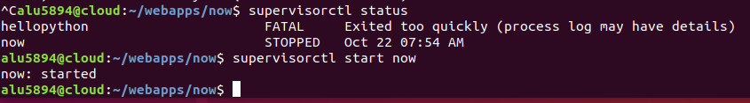

Creamos un script en python que ejecute el comando asignado para que lea el archivo python (en este caso, main.py).

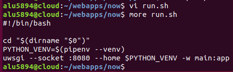

Creamos el Virtual Host y lo configuramos.

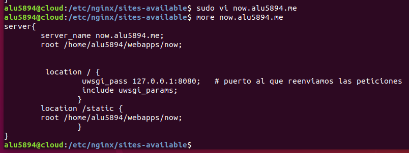

Enlazamos con sites-enabled.

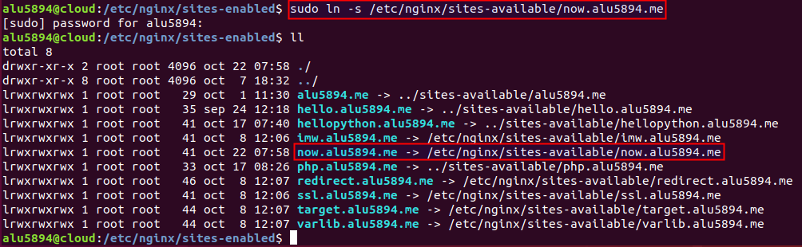

Recargamos nginx y comprobamos.

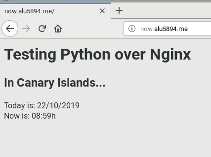
