# Implantación de Wordpress

---
## Configuración de base de datos

Primero iremos a MySQL y crearemos una base de datos
junto con un usuario y sus respectivos permisos.

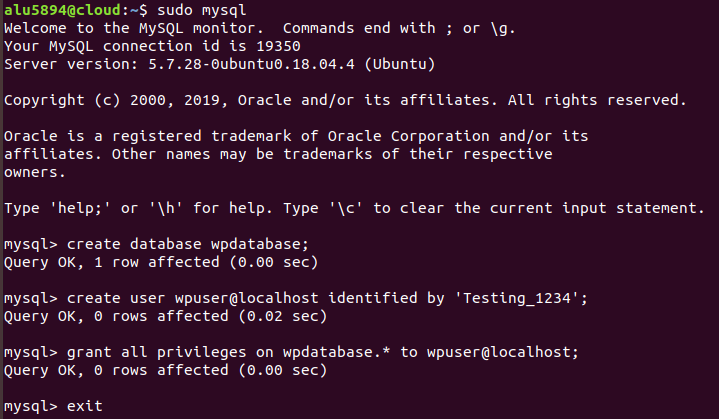

---
## Descarga de código

Descargamos el código fuente de Wordpress desde su página web.

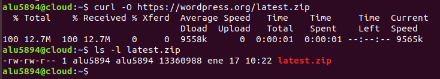

A continuación descomprimimos el código y lo copiamos en /usr/share.

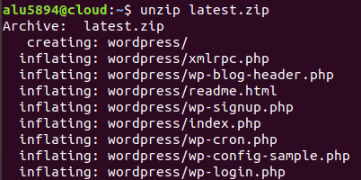

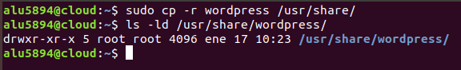
Ahora tenemos que establecer los permisos necesarios para que el usuario web www-data pueda usar estos ficheros.

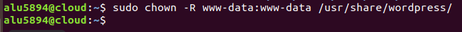

---
## Editar ficheros de configuración

Para una configuración básica de WordPress debemos especificar lo siguiente:

* El nombre de la base de datos
* El usuario
* La contraseña

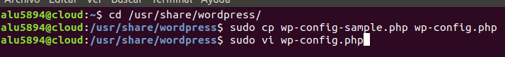

Aproximadamente en la línea 23.

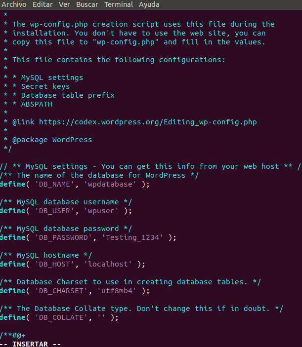

---
## Acceso mediante Nginx

PAra que nuestro sitio Wordpress sea accesible desde un navegador web, debemos incluir las directivas necesarias en la configuración del servidor web Nginx.

Supongamos que queremos acceder a nuestro Wordpress desde la url wordpress.alu5894.me. Para ello tendremos que crear un nuevo virtual host de la siguiente manera:

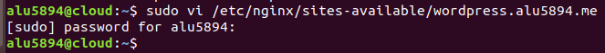

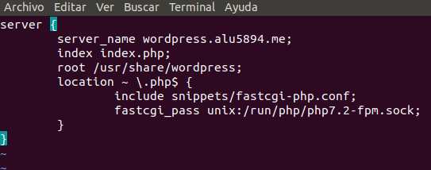

```
server {
    server_name wordpress.vps.claseando.es;
    index index.php;
    root /usr/share/wordpress;
    location ~ \.php$ {
        include snippets/fastcgi-php.conf;
        fastcgi_pass unix:/run/php/php7.2-fpm.sock;
    }
}
```

Enlazamos la configuración para que el Virtual Host esté disponible.

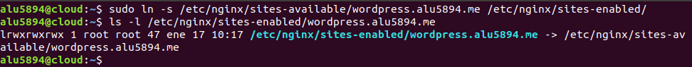

Recargamos el servidor de Nginx para que los cambios sean efectivos.

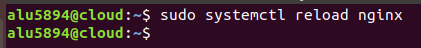

---
## Configuración del sitio vía web

Ahora podemos acceder a la dirección de nuestro servidor para configurar nuestro Wordpress vía web.

Cuando accedemos a http://wordpress.alu5894.me nos redirige a http://wordpress.alu5894.me/wp-admin/install.php:

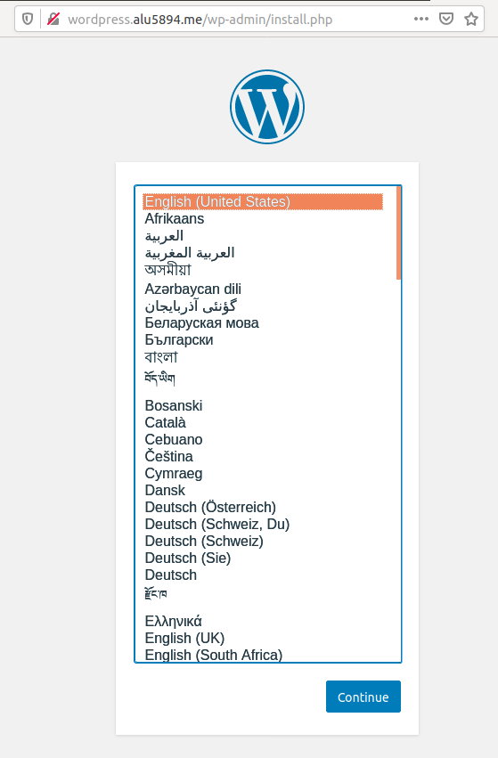


Elegimos español y le damos a continuar.

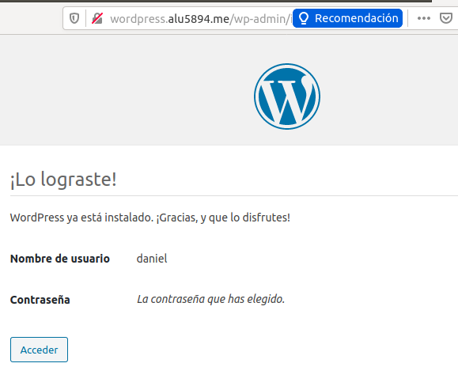

Rellenamos los campos que nos piden y pulsamos instalar WordPress.
Pulsamos en el boton acceder e ingresamos nuestras credenciales.

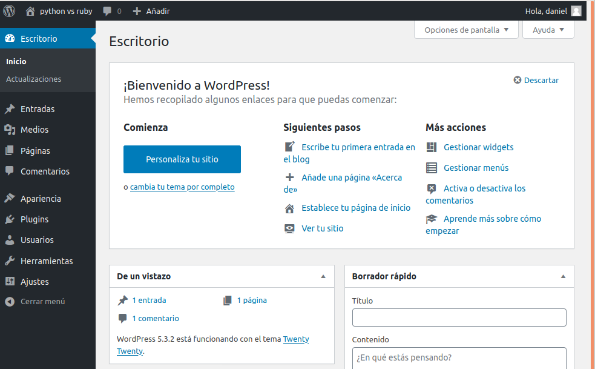

Así habremos podido acceder a la interfaz administrativa de WordPress.

---
## Ajuste de permalinks

En primer lugar activamos esta opción dentro de la interfaz administrativa de Wordpress. Seleccionamos el ajuste Día y nombre. Pulsamos en guardar cambios.

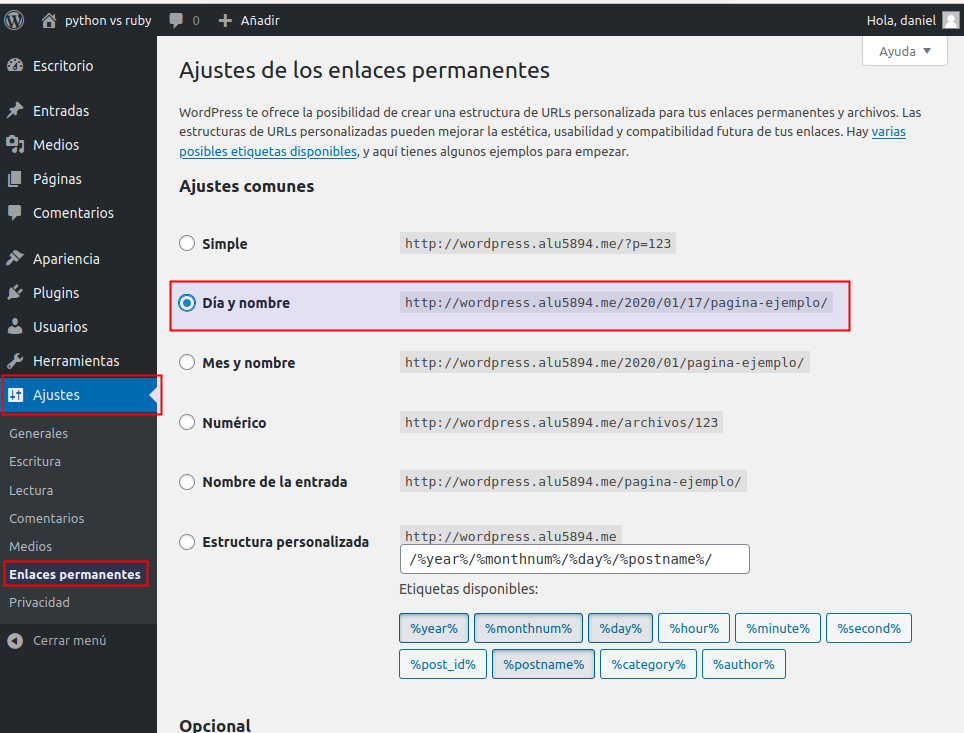

Ahora debemos indicar a Nginx que procese estas URLs.

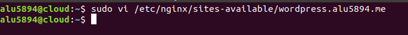

```
location / {
    try_files $uri $uri/ /index.php?$args;
}
```

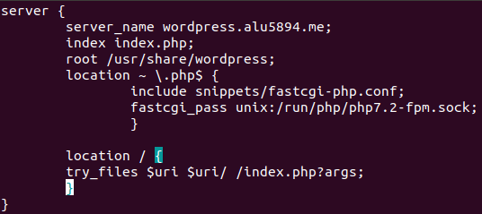

No olvidarnos de recargar la configuración.

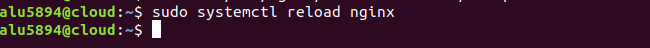

---
## Límite de tamaño en la subida de archivos

Por defecto, el límite de subida de archivos para aplicaciones PHP suele ser bastante bajo, en torno a los 2MB.

Para incrementarlo, debemos hacer lo siguiente, como root en la máquina de producción:

```
sudo vi /etc/php/7.2/fpm/php.ini
```

Buscar y modificar solo las siguientes líneas.

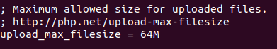

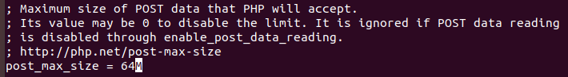

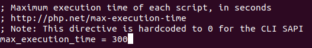

Ahora reiniciamos el servicio php-fpm.

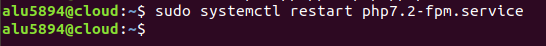

Además de esto, debemos añadir una línea en el fichero de configuración de Nginx.

```
sudo vi /etc/nginx/nginx.conf
```

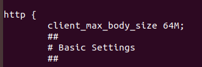

```
http {

    ##
    # Custom settings
    ##

    client_max_body_size 64M;
```

A continuación reiniciamos el servidor web Nginx para que tengan efectos los cambios realizados en el fichero de configuración.

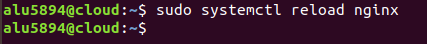

---
## Estructura de ficheros

```
alu5894@cloud:~$ cd /usr/share/wordpress/wp-content/
alu5894@cloud:/usr/share/wordpress/wp-content$ ls
index.php  languages  plugins  themes  upgrade  uploads
alu5894@cloud:/usr/share/wordpress/wp-content$ tree -d
.
├── languages
│   ├── plugins
│   └── themes
├── plugins
│   └── akismet
│       ├── _inc
│       │   └── img
│       └── views
├── themes
│   ├── twentynineteen
│   │   ├── classes
│   │   ├── fonts
│   │   ├── inc
│   │   ├── js
│   │   ├── sass
│   │   │   ├── blocks
│   │   │   ├── elements
│   │   │   ├── forms
│   │   │   ├── layout
│   │   │   ├── media
│   │   │   ├── mixins
│   │   │   ├── modules
│   │   │   ├── navigation
│   │   │   ├── site
│   │   │   │   ├── footer
│   │   │   │   ├── header
│   │   │   │   ├── primary
│   │   │   │   └── secondary
│   │   │   ├── typography
│   │   │   └── variables-site
│   │   └── template-parts
│   │       ├── content
│   │       ├── footer
│   │       ├── header
│   │       └── post
│   ├── twentyseventeen
│   │   ├── assets
│   │   │   ├── css
│   │   │   ├── images
│   │   │   └── js
│   │   ├── inc
│   │   └── template-parts
│   │       ├── footer
│   │       ├── header
│   │       ├── navigation
│   │       ├── page
│   │       └── post
│   ├── twentysixteen
│   │   ├── css
│   │   ├── genericons
│   │   ├── inc
│   │   ├── js
│   │   └── template-parts
│   └── twentytwenty
│       ├── assets
│       │   ├── css
│       │   ├── fonts
│       │   │   └── inter
│       │   ├── images
│       │   └── js
│       ├── classes
│       ├── inc
│       ├── template-parts
│       └── templates
├── upgrade
└── uploads
    └── 2020
        └── 01

68 directories
alu5894@cloud:/usr/share/wordpress/wp-content$
```
