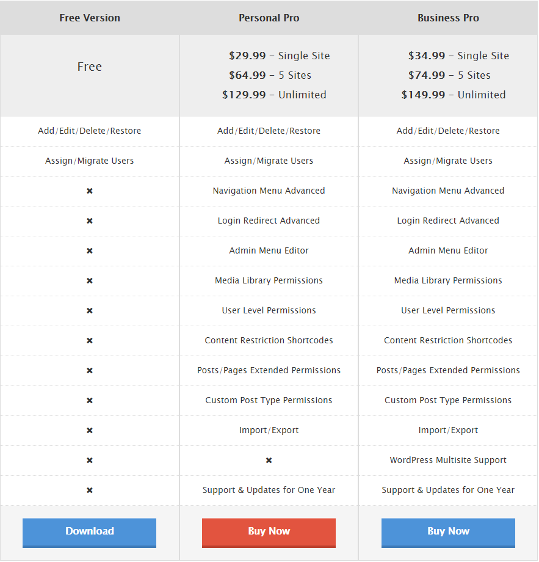
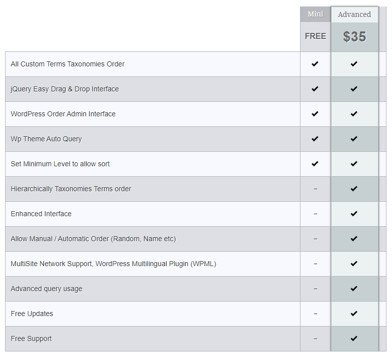

# User Role Editor

Es un plugin que permite cambiar roles y capacidades/funciones fácilmente. Un usuario puede tener varios roles al mismo tiempo.

## Detalles

**Versión:** 4.53

**Last Update:** hace 5 días

**Versión de WordPress necesaria:** 4.0 o superior

**Compatible con:** 5.3.2

**Versión PHP necesaria:** 5.5 o superior

**Instalaciones activas:** 600.000+

### Contra:

-Otros plugins pueden no complementarse con éste y al final deberemos de dar el rol por defecto que nos viene en WP.

# Category Order and Taxonomy Terms Order

Este plugin nos da la posibilidad de definir el orden de categorías jerárquicamente.

## Detalles

**Versión:** 1.5.7.1

**Last Update:** hace 2 meses

**Versión de WordPress necesaria:** 2.8 o superior

**Compatible con:** 5.3.2

**Instalaciones activas:** 400.000+

# Force Regenerate Thumbnails

Permite eliminar todo el tamaño de las imágenes antiguas y REALMENTE regenerar las miniaturas de sus archivos adjuntos de imágenes.

## Detalles

**Versión:** 2.0.6

**Last Update:** 4 años

**Versión de WordPress necesaria:** 2.8 o superior

**Compatible con:** 4.0.29

**Instalaciones activas:** 2M+

### Contra

Estos plugins utilizan potencia de CPU y recursos de RAM del servidor para generar las miniaturas o thumbnails de las imágenes. Por lo que si tu hosting o servidor es muy limitado, puede llegar a darte problemas a la hora de regenerar estos elementos.
